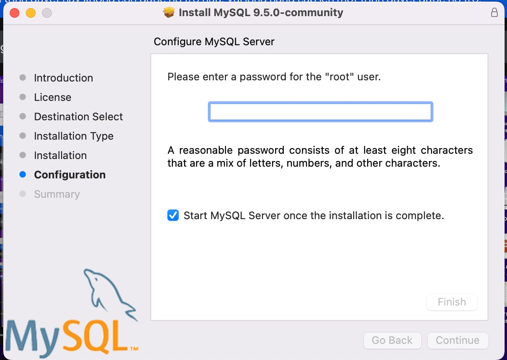
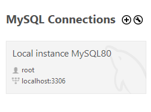
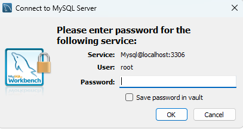
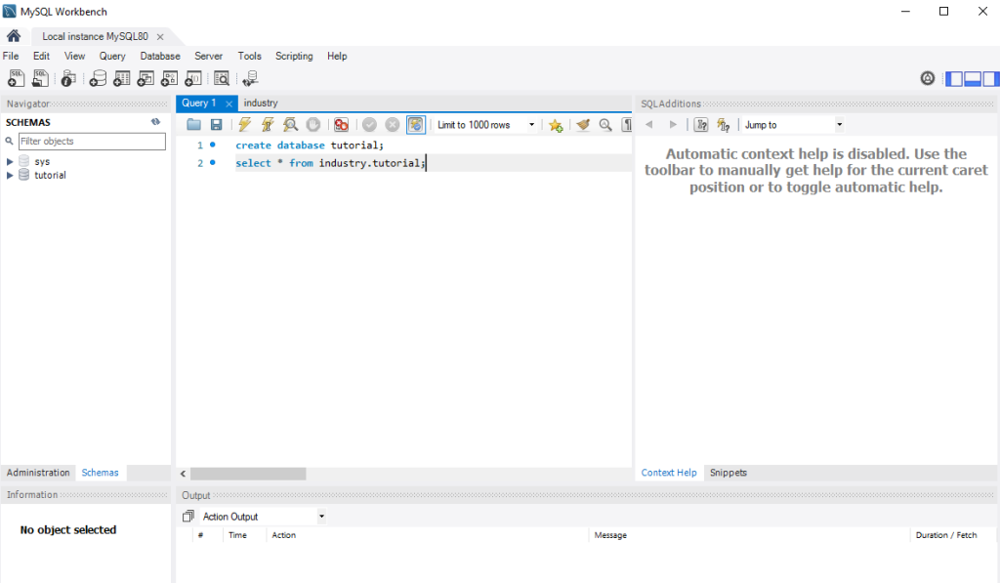
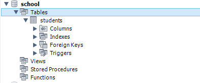

# Setup Mysql 

## With 
## Install Mysql on MacOS
- Link: https://dev.mysql.com/downloads/mysql/

- Setup mysql password after download
  - 
- Download Mysql Workbench (GUI tool)
  - Link: https://dev.mysql.com/downloads/workbench/
- Start Mysql server
  - 

- Login
  - 
- After login success
- 

- you can try create database
```sql
CREATE DATABASE helloworld;
       
DROP DATABASE helloworld;
     
CREATE DATABASE school;

use school;
    
create table students (
    id INT PRIMARY KEY,
    name VARCHAR(100),
    age INT
);
```

