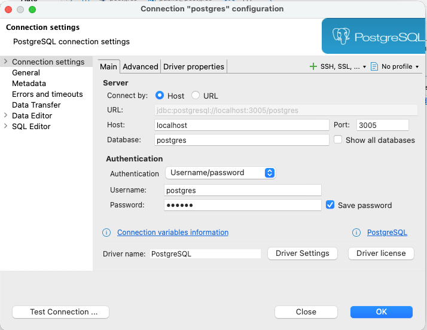

# Setup PostgreSql

## Setup postgreSql with Docker Desktop and DBeaver
### Docker desktop 
- name: `postgresql-container`
- port: `3005`
- variables:
  - `POSTGRES_PASSWORD` : `password`

- Reference: https://youtu.be/xw5BennCNiM?si=VBtxRL9H-aOIeDP2

### DBeaver
- 
- Add connection.
- post: 3005
- Database: `postgres`
- username: `postgres`
- password: `password`